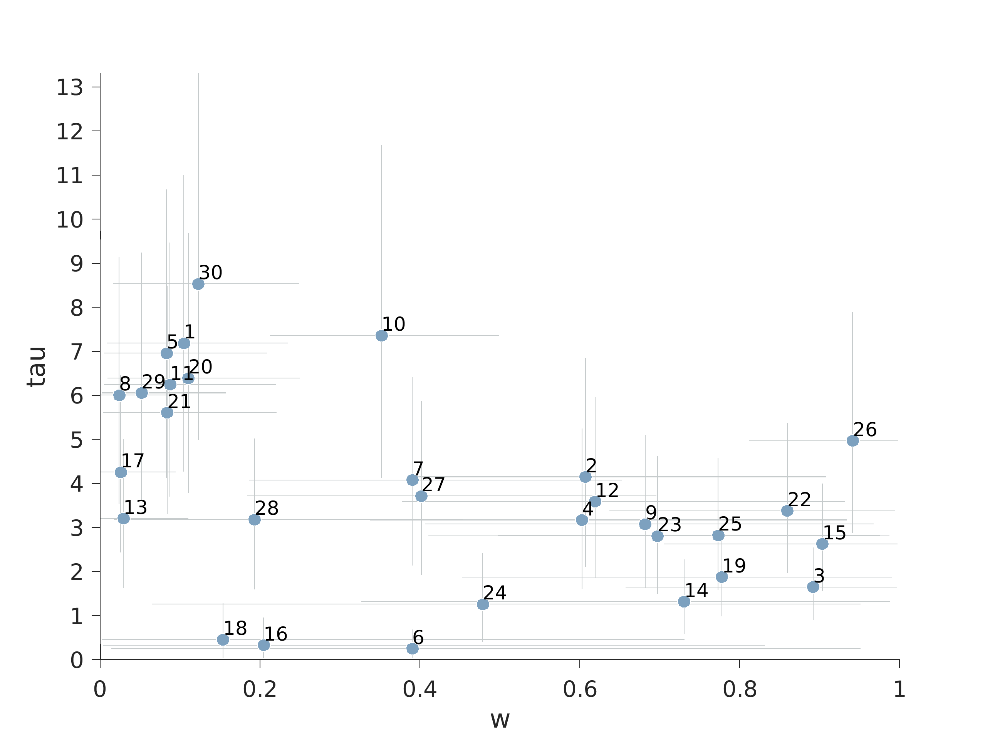
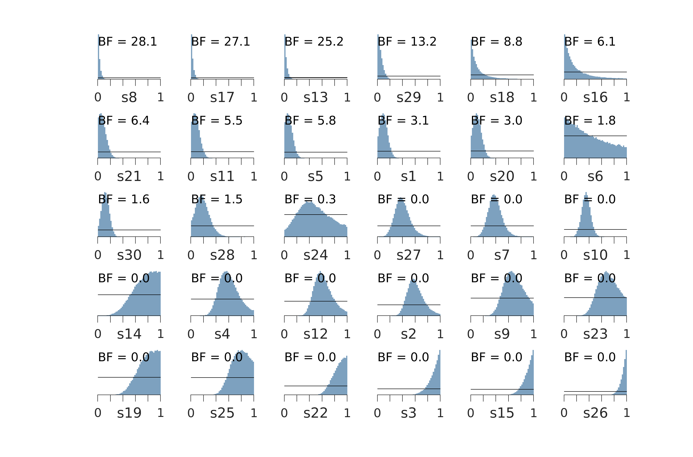
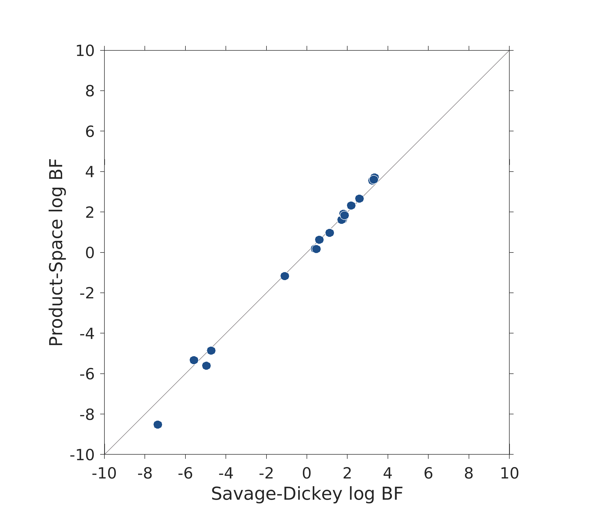

# Consensus in Choice

This project is a draft re-analysis of the data and models considered by [Mistry and Liljeholm (2019)](https://www.nature.com/articles/s41598-019-38560-4).

## Data

The data come from a Experiment 1. The data were parsed using the MATLAB script `parseData_1.m`, to create the data file `MistryLiljeholmExp1.mat`.

Th experiment in which 30 participants each did 60 trials. Each trial had two options, with given values, as well as information about the consensus choice of others. WE denote the majority option value as $v^A$ and the minority option value as $v^B$. There are only five levels of difference in the values between the majority and minority options $\Delta v = \left(-0.6, -0.3, 0, 0.3, 0.6\right)$,  and only two levels of consensus $c = \left(\frac{5}{6}, 1\right)$. 

The data are plotted below, using the MATLAB script `plotData_2.m`. Each panel corresponds to a participant. The $x$-axis is the difference $\Delta v$, thet two lines correspond to the low $c=\frac{5}{6}$ and high $c=1$ majority, and the $y$-axis is the proportion of times the majority option was chosen.


There are clear individual differences in the pattern of choices made by the participants. One interpretation is that there are at least three qualitatively different sub-groups of participants
* participants such as p1, p5, p8, p10, p17, among others, who show a characteristic  sigmoidal relationship between value difference and choice probabilities, consistent with  attending to the value difference
*  participants such as p3, p15, and p26, who show a strong preference for choosing the majority option regardless of the value difference, consistent with attending to the consensus information
* participants such as p6, p16, and p18, who either consistently choose the minority option or become more likely to choose the minority as the value information more strongly favors the majority, neither of which is not consistent with using the value difference or consensus information to make choices

There also more fine-grained individual differences within the first of these sub-groups, related to the relative weight given to consensus information. This is reflected in the precise shape of the sigmoid function. For example, when the value difference is zero, p17 chooses the majority option only a little more than half the time, whereas p20 almost always the majority option. The choices of these two participants are similar for all other value differences, suggesting that p20 uses the consensus information as a stronger tie breaker

## Modeling

### Basic model

The basic model assumes a soft-max choice rule. Let $y_{ij} = 1$ if the $i$th participant on their $j$ trial chooses the majority option, and $y_{ij}=0$ if they choose the minority option. The strength of the majority option in this trial is $r^A_{ij} = v^A_{ij} + w_ic_{ij}$ where $w_i\sim\mathrm{Uniform}\left(0,1\right)$ is a weight parameter that controls the relative importance of the consensus information. The strength of the minority option is simply  $r^{B}_{ij} = v^B_{ij}$. The probability of choosing the majority option is then given by

$$
\theta_{ij} = \frac{\exp\left(\tau_i r^A_{ij}\right)}{\left(\exp\left(\tau_i r^A_{ij}\right)+\exp\left(\tau_i r^B{ij}\right)\right)}
$$

where $\tau_i\sim\mathrm{Gamma}\left(2,1\right)$ is a temperature parameter controlling the determinism of responding. The prior makes modal behavior $\tau=1$ which corresponds to probability matching, while also allowing for more chance-like behavior as $\tau\rightarrow1$ and deterministic responding as $\tau\rightarrow\infty$. The prior also ensures that the prior predictive mass given to fully deterministic responding does not dominate the other possibilities.

This model is implemented by the JAGS scripts `consensus_2.txt` below, and applied to the data by the MATLAB script `consensus_2.m`.


```
model{
  for (i in 1:nSubjects){
    for (j in 1:nTrials){
      # data
      y[i, j] ~ dbern(theta[i, j])
      # model
      r[i, j, 1] = m[i, j, 1] + w[i]*c[i, j] # majority option
      r[i, j, 2] = m[i, j, 2]			     # minority option
      theta[i, j] = exp(tau[i]*r[i, j, 1]) / (exp(tau[i]*r[i, j, 1]) + exp(tau[i]*r[i, j, 2]))
    }
  }	
  # priors
  for (i in 1:nSubjects){
    w[i] ~ dunif(0, 1)
    tau[i] ~ dgamma(2, 1)
  }
}
```
The following figure summarizes the joint posterior distributions for the $w$ and $\tau$ parameters for all 30 participants. Circular markers correspond to posterior means, and the error bars show 95% credible intervals.



### Model Comparison

The following figure shows. as blue histograms, the posterior distributions of the $w$ parameter for each participant. Also shown, as a solid line, is the uniform prior distribution. Following the Savage-Dickey method, a comparison of the prior and posterior densities at $w=0$ provides an estimate of the Bayes factor, for each individual participant, comparing the choice model in which $w=0$ against the one with $w\sim\mathrm{Uniform}\left(0,1\right)$, This is naturally interpreted as a comparison of two choice: one which assumes both the values and consensus play a role in decision making, and one which assumes only the values play a role. The Bayes factor listed for each participant is expressed in favor of the "null” model in which consensus plays no role.



An alternative way to estimate the Bayes factors is using a product space method. This involves a latent-mixture model, in which a binary parameter $z_i\sim\mathrm{Bernoulli}\left(\frac{1}{2}\right)$ indicates which of the two models generates the behavior of the $i$th participant.

This model is implemented by the JAGS scripts `consensus_2b.txt` below, and applied to the data by the MATLAB script `consensus_2b.m`.

```
model{
  for (i in 1:nSubjects){
    for (j in 1:nTrials){
      # data
      y[i, j] ~ dbern(theta[i, j, z[i]+1])
      # model
      r[i, j, 1] = m[i, j, 1] + w[i]*c[i, j] # majority option
      r[i, j, 2] = m[i, j, 2]			     # minority option
      theta[i, j, 1] = exp(tauA[i]*r[i, j, 1])/(exp(tauA[i]*r[i, j, 1]) + exp(tauA[i]*r[i, j, 2]))
      theta[i, j, 2] = exp(tauB[i]*m[i, j, 1])/(exp(tauB[i]*m[i, j, 1]) + exp(tauB[i]*m[i, j, 2]))
    }
  }	
  # priors
  for (i in 1:nSubjects){
    w[i] ~ dunif(0, 1)
    tauA[i] ~ dgamma(2, 1)
    tauB[i] ~ dgamma(2, 1)
    z[i] ~ dbern(1/2)
  }
}
```
The posterior mean of $z$ corresponds to the posterior probability of the null model and, given the equal model priors, also to the Bayes factor. The following figure shows that the (log) Bayes factors are estimated to be the same for each participants using both the Savage-Dickey and Bayes factor method. It also confirms that many participants are better explained by the null model, consistent with the original observation of qualitative differences.


### Overall Model

The latent mixture model forms the basis for our suggested overall model. One addition is to allow for a base-rate parameter $\phi\sim\mathrm{Uniform}\left(0,1\right)$ corresponding to the proportion of participants who do not use consensus, so that now $z_i\sim\mathrm{Bernoulli}\left(\phi\right)$ . The other extension is to assume the weights given to consensus by those participants who do use consensus come from a group distribution. This is achieved in the standard hierarchical way, with individual-level sampling $w_i\sim\mathrm{Gaussian}\left(\mu_w,1/\sigma_w^2\right)T\left(0,1\right)$, and group-level priors $\mu_w, \sigma_w\sim\mathrm{Uniform}\left(0,1\right)$.

This model is implemented by the JAGS scripts `consensus_3.txt` below, and applied to the data by the MATLAB script `consensus_3.m`.
```
model{
  for (i in 1:nSubjects){
    for (j in 1:nTrials){
      # data
      y[i, j] ~ dbern(theta[i, j, z[i]+1])
      # model
      r[i, j, 1] = m[i, j, 1] + w[i]*c[i, j] # majority option
      r[i, j, 2] = m[i, j, 2]			     # minority option
      theta[i, j, 1] = exp(tauA[i]*r[i, j, 1])/(exp(tauA[i]*r[i, j, 1]) + exp(tauA[i]*r[i, j, 2]))
      theta[i, j, 2] = exp(tauB[i]*m[i, j, 1])/(exp(tauB[i]*m[i, j, 1]) + exp(tauB[i]*m[i, j, 2]))
    }
  }	
  # priors
  for (i in 1:nSubjects){
    w[i] ~ dnorm(muW, 1/sigmaW^2)T(0, 1)
    tauA[i] ~ dgamma(2, 1)
    tauB[i] ~ dgamma(2, 1)
    z[i] ~ dbern(phi)
  }
  muW ~ dunif(0, 1)
  sigmaW ~ dunif(0, 1)
  phi ~ dunif(0, 1)
  # representatitve
  repW ~ dnorm(muW, 1/sigmaW^2)T(0, 1)
}
```

The following figure shows the results of applying the overall model to the data. Those participants inferred not to attend to the consensus now have $w=0$. (Displayed with a little jitter for visual identifiability). The inferences for the individual participants remain extremely interpretable in terms of the original insights from the visual analysis of the behavioral data.


The overall model provides a number of other potentially useful inferences that are not shown. These include inferences about the base-rate $\phi$ and the representative distribution of $w$ sampled by the variable `repW`. This distribution can be thought of as the range of potential weights people might apply to consensus in the task. Or, equivalently, as the distribution from which the $w$ of the next person to be tested will be sampled.

The overall model could be extended further to provide an account of when and why participants either attend to or ignore consensus information. The most direct way to achieve this would be to regress the sampling of $z_i$ on relevant observed covariates. 
